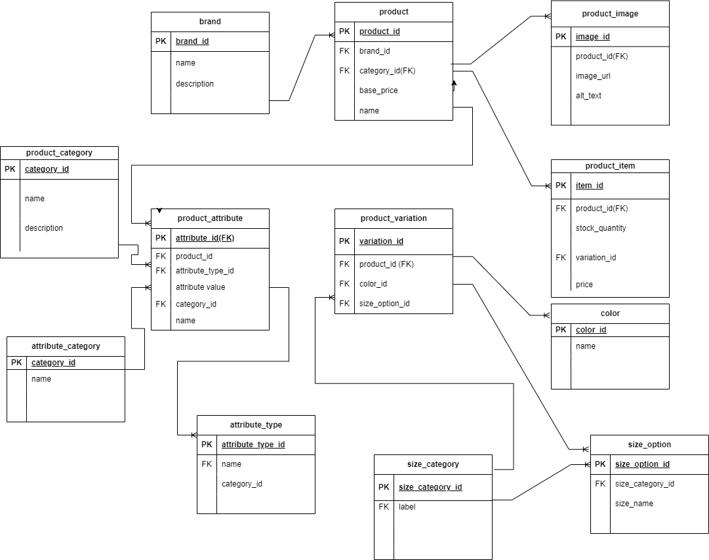

# e_commerceDB
# E-Commerce Platform Database Schema

## Overview
This database schema is designed to support a robust and scalable e-commerce platform. It organizes product information, variations, categories, attributes, and relationships between them, enabling efficient management and retrieval of data.

## ERD

## Table Structure

### 1. `brand`
- **Description**: Stores details about product brands.
- **Columns**:
  - `brand_id`: (Primary Key): Unique identifier for each brand.
  - `brand_name`: Name of the brand (e.g., Nike, Apple).
  - `brand_description`: Gives a brief eplanantion of the brand.

### 2. `product`
- **Description**: Contains general details about products.
- **Columns**:
  - `product_id`: (Primary Key): Unique identifier for each product.
  - `product_name`: Name of the product (e.g., Running Shoes, iPhone 14).
  - `product_price`:Price of the product.
  - `brand_id` :(Foreign Key): References `brand(brand_id)`.

### 3. `product_category`
- **Description**: Groups products into categories for better organization.
- **Columns**:
  - `category_id`: (Primary Key): Unique identifier for each category.
  - `category_name`: Name of the category (e.g., Footwear, Electronics).

### 4. `product_image`
- **Description**: Stores image URLs or file references for products.
- **Columns**:
  - `image_id` :(Primary Key): Unique identifier for each image.
  - `product_id` :(Foreign Key): References `product(product_id)`.
  - `image_url`: URL of the product image.

### 5. `color`
- **Description**: Defines available color options for products.
- **Columns**:
  - `color_id`: (Primary Key): Unique identifier for each color.
  - `color_name`: Name of the color (e.g., Red, Blue).

### 6. `size_category`
- **Description**: Groups sizes into categories, such as clothing or shoe sizes.
- **Columns**:
  - `size_category_id`: (Primary Key): Unique identifier for each size category.
  - `category_name`: Name of the category (e.g., Clothing Sizes, Shoe Sizes).

### 7. `size_option`
- **Description**: Lists specific size options for products.
- **Columns**:
  - `size_id` :(Primary Key): Unique identifier for each size.
  - `size_name`: Name of the size (e.g., S, M, L, 42).
  - `size_category_id` :(Foreign Key): References `size_category(size_category_id)`.

### 8. `product_variation`
- **Description**: Links products to their variations, such as size or color.
- **Columns**:
  - `variation_id` :(Primary Key): Unique identifier for each variation.
  - `product_id`: (Foreign Key): References `product(product_id)`.
  - `size_id` :(Foreign Key): References `size_option(size_id)`.
  - `color_id`: (Foreign Key): References `color(color_id)`.

### 9. `product_item`
- **Description**: Represents individual purchasable items with specific variations.
- **Columns**:
  - `item_id` :(Primary Key): Unique identifier for each item.
  - `product_id` :(Foreign Key): References `product(product_id)`.
  - `variation_id`: (Foreign Key): References `product_variation(variation_id)`.
  - `product_price`: Price of the item.
  - `stock`: Quantity available in stock.

### 10. `product_attribute`
- **Description**: Stores custom attributes for products, such as material or weight.
- **Columns**:
  - `attribute_id` :(Primary Key): Unique identifier for each attribute.
  - `product_id`: (Foreign Key): References `product(product_id)`.
  - `attribute_type_id` :(Foreign Key): References `attribute_type(type_id)`.
  - `attribute_value`: Value of the attribute (e.g., Mesh, 3.9 kg).
  - `category_id` :(Foreign Key): References `attribute_category(category_id)`.

### 11. `attribute_category`
- **Description**: Groups attributes into categories, such as physical or technical properties.
- **Columns**:
  - `category_id` :(Primary Key): Unique identifier for each category.
  - `category_name`: Name of the category (e.g., Physical Properties, Technical Features).

### 12. `attribute_type`
- **Description**: Defines types of attributes, such as text, number, or boolean.
- **Columns**:
  - `type_id` :(Primary Key): Unique identifier for each type.
  - `type_name`: Name of the attribute type (e.g., Weight, Material, Screen Size).
  - `category_id`: (Foreign Key): References `attribute_category(category_id)`.

## Relationships
- **Brands and Products**: Each product is linked to a brand via `brand_id`.
- **Product Variations**: Variations (e.g., size, color) are managed through `product_variation`.
- **Attributes**: Products have custom attributes categorized into `attribute_category`.

## Usage
- **Flexibility**: The schema allows for dynamic addition of variations, categories, and attributes.
- **Search & Filtering**: Use relationships for efficient filtering and querying (e.g., by category, size, color, or attributes).

---

Feel free to adapt this README to your specific development workflow or additional requirements!
